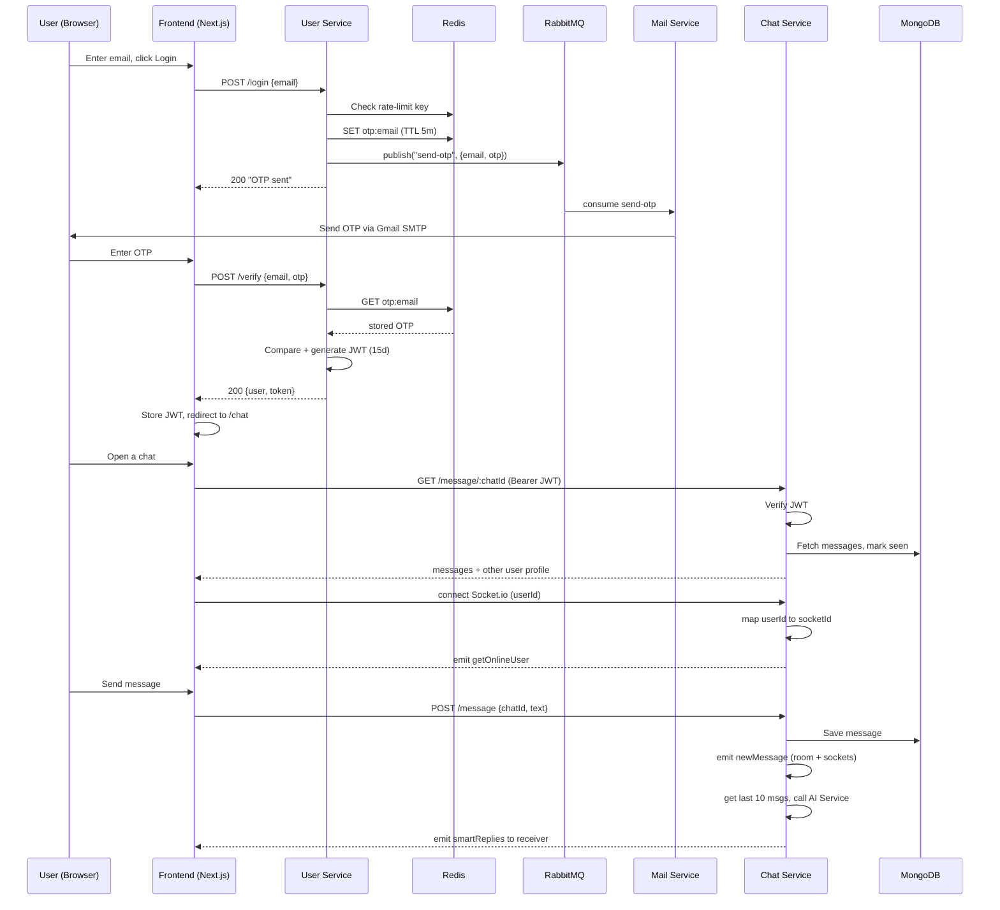
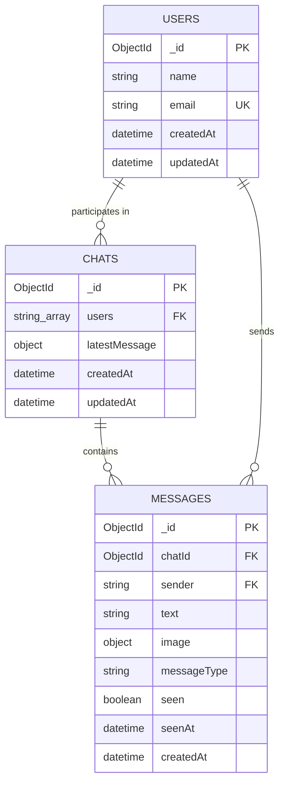

# NexusChat 💬

## 1. Project Overview

### 1.1 Product Summary

**NexusChat** is a real-time, one-to-one messaging platform built on a **microservices architecture**, featuring:

- **Instant messaging** — text & image messages delivered over WebSockets
- **Presence & typing indicators** — see who's online and when they're typing
- **Read receipts** — room-aware "seen" tracking
- **AI Smart Replies** — LLM-generated quick-reply suggestions powered by Mistral AI
- **Passwordless authentication** — OTP-based login via email, no passwords stored

### 1.2 Architecture Principle

The platform is split into **4 independently deployable backend services**, each owning its own data store and responsibility — no shared databases, no tight coupling. Services talk to each other over **REST (sync)** and **RabbitMQ (async)**, so a slowdown or outage in one service degrades gracefully instead of taking down the whole app.

| Service | Owns | Talks To |
|---|---|---|
| **User Service** | Auth, Profiles | Redis (OTP), RabbitMQ (publishes) |
| **Chat Service** | Messages, Sockets | User Service (HTTP), AI Service (HTTP) |
| **AI Service** | Smart Replies | Mistral API, Redis (cache) |
| **Mail Service** | Email delivery | RabbitMQ (consumes) |

---

## 2. Tech Stack & Deployment Architecture

### 2.1 Technology Stack

#### 🌐 Frontend


| Concern | Choice |
|---|---|
| Framework | Next.js 15 (App Router) |
| UI Library | React 19 |
| Styling | Tailwind CSS 4 |
| Language | TypeScript |
| Realtime | Socket.io-client |
| HTTP Client | Axios |
| State | React Context (App + Socket) |

#### 🟢 Backend — User Service · Port `5000`


| Concern | Choice |
|---|---|
| Database | MongoDB (Mongoose) |
| Cache | Redis (OTP + rate limiting) |
| Queue | RabbitMQ (publisher) |
| Auth | JWT (15-day expiry) |
| Entry Point | `src/index.ts` |

#### 🟢 Backend — Chat Service · Port `5001`


| Concern | Choice |
|---|---|
| Database | MongoDB (Mongoose) |
| Media | Cloudinary (via Multer) |
| Entry Point | `src/index.ts` |

#### 🟢 Backend — AI Service · Port `5003`


| Concern | Choice |
|---|---|
| LLM Provider | Mistral AI (mistral-small) |
| Cache | Redis (1hr TTL on responses) |
| Entry Point | `src/index.ts` |

#### 🟢 Backend — Mail Service · Port `5002`


| Concern | Choice |
|---|---|
| Role | RabbitMQ consumer only (no REST routes) |
| Email | Nodemailer (Gmail SMTP) |
| Entry Point | `src/index.ts` |

#### 🟡 Infrastructure


---

## 3. NexusChat — High-Level System Architecture

```mermaid
graph TB
    subgraph Client["🖥️ Client"]
        Browser["Web Browser<br/>Desktop / Mobile"]
    end

    subgraph Frontend["🌐 Frontend"]
        NextApp["Next.js App<br/>React 19 + Socket.io-client"]
    end

    subgraph Backend["⚙️ Backend Services"]
        UserSvc["User Service<br/>Auth + Profiles<br/>:5000"]
        ChatSvc["Chat Service<br/>Messages + Sockets<br/>:5001"]
        AISvc["AI Service<br/>Smart Replies<br/>:5003"]
        MailSvc["Mail Service<br/>OTP Consumer<br/>:5002"]
    end

    subgraph Data["💾 Data & Infra"]
        Mongo[("MongoDB<br/>Users / Chats / Messages")]
        Redis[("Redis<br/>OTP, Rate-limit, AI Cache")]
        Rabbit{{"RabbitMQ<br/>send-otp queue"}}
        Cloud["Cloudinary<br/>Image Storage"]
        Mistral["Mistral AI API"]
    end

    Browser -- "1. HTTP Request" --> NextApp
    NextApp -- "2. Login (email)" --> UserSvc
    UserSvc -- "3. Store OTP (TTL 5m)" --> Redis
    UserSvc -- "4. Publish send-otp" --> Rabbit
    Rabbit -- "5. Consume" --> MailSvc
    MailSvc -- "6. SMTP send" --> Browser

    NextApp -- "7. Verify OTP" --> UserSvc
    UserSvc -- "8. Issue JWT" --> NextApp

    NextApp -- "9. API calls (Bearer JWT)" --> ChatSvc
    NextApp <-. "WebSocket (live events)" .-> ChatSvc
    ChatSvc -- "10. Verify JWT" --> ChatSvc
    ChatSvc -- "11. CRUD" --> Mongo
    ChatSvc -- "12. Enrich profile" --> UserSvc
    UserSvc -- "13. Query" --> Mongo
    ChatSvc -- "14. Upload image" --> Cloud
    ChatSvc -- "15. Get smart replies" --> AISvc
    AISvc -- "16. Check cache" --> Redis
    AISvc -- "17. Cache miss to LLM call" --> Mistral

    style Client fill:#3b1f1f,stroke:#e05555
    style Frontend fill:#1f2d3b,stroke:#4a90d9
    style Backend fill:#1f3b26,stroke:#4ad978
    style Data fill:#3b331f,stroke:#d9a84a
```



**Legend:** 🔴 Client · 🔵 Frontend · 🟢 Backend Services · 🟡 Data & Infra

---

## 4. Authentication & Real-Time Message Flow



---

## 5. Database Architecture



**Notes on schema design:**
- `Chat.users` stores raw user IDs (strings) rather than a separate join table — appropriate since chats here are always 1:1, so `$all + $size:2` on a 2-element array is enough to look up an existing conversation.
- `Chat.latestMessage` is **denormalized** onto the Chat document itself — an intentional trade-off so the chat list/sidebar can render previews without a join or extra query per chat.
- `Messages.seen` / `seenAt` support read-receipt UI without needing a separate "read tracking" collection.
- User profiles are **not embedded** in Chat/Messages — they're fetched live from the User Service by ID, keeping the Chat service's database free of duplicated, staleness-prone user data (classic microservices trade-off: an extra network hop in exchange for a single source of truth).

---

## 6. Project Structure

```
NexusChat/
├── docker-compose.yml          # MongoDB, Redis, RabbitMQ infra
├── backend/
│   ├── user/                   # Auth & user profile microservice
│   │   └── src/
│   │       ├── config/         # db, redis, rabbitmq, JWT helpers
│   │       ├── controllers/    # login, verify, profile, updateName
│   │       ├── middleware/     # isAuth (JWT verification)
│   │       ├── model/          # User schema
│   │       └── routes/
│   ├── chat/                   # Messaging + Socket.io microservice
│   │   └── src/
│   │       ├── config/         # db, socket.io, cloudinary
│   │       ├── controllers/    # createChat, sendMessage, getMessages
│   │       ├── middlewares/    # isAuth, multer (image upload)
│   │       ├── models/         # Chat, Messages schemas
│   │       ├── routes/
│   │       └── services/       # AI service HTTP client
│   ├── ai/                     # Smart-reply microservice
│   │   └── src/
│   │       ├── config/         # redis client
│   │       ├── controllers/    # getSuggestions
│   │       ├── routes/
│   │       └── services/       # Mistral client wrapper
│   └── mail/                   # Async email consumer microservice
│       └── src/
│           ├── index.ts
│           └── consumer.ts     # RabbitMQ "send-otp" consumer
└── frontend/
    └── src/
        ├── app/                 # Next.js App Router pages (login, verify, chat, profile)
        ├── components/          # ChatSidebar, ChatHeader, ChatMessages, MessageInput, VerifyOtp
        └── context/             # AppContext (auth), SocketContext (socket.io client)
```

---

## 7. API Reference

### User Service (`:5000/api/v1`)
| Method | Endpoint | Description | Auth |
|---|---|---|---|
| POST | `/login` | Request OTP for an email | ❌ |
| POST | `/verify` | Verify OTP, returns JWT + user (auto-creates user on first login) | ❌ |
| GET | `/me` | Get current authenticated user | ✅ |
| GET | `/user/all` | List all users | ✅ |
| GET | `/user/:id` | Get a specific user's public profile | ❌ (internal service call) |
| POST | `/update/user` | Update display name | ✅ |

### Chat Service (`:5001/api/v1`)
| Method | Endpoint | Description | Auth |
|---|---|---|---|
| POST | `/chat/new` | Create (or fetch existing) 1:1 chat | ✅ |
| GET | `/chat/all` | List all chats for the current user, with unseen counts | ✅ |
| POST | `/message` | Send a text or image message | ✅ |
| GET | `/message/:chatId` | Fetch chat history, marks messages as seen | ✅ |

### AI Service (`:5003/api/v1/ai`)
| Method | Endpoint | Description |
|---|---|---|
| POST | `/suggestions` | Returns 3 AI-generated smart reply suggestions for a conversation |

### Socket.io Events
| Event | Direction | Purpose |
|---|---|---|
| `getOnlineUser` | Server → Client | Broadcast list of currently online user IDs |
| `joinChat` / `leaveChat` | Client → Server | Join/leave a specific chat room |
| `typing` / `stopTyping` | Client → Server → Client | Typing indicator relay |
| `newMessage` | Server → Client | New message delivery |
| `messagesSeen` | Server → Client | Read-receipt updates |
| `smartReplies` | Server → Client | AI-generated reply suggestions |

---

## 8. Getting Started

### Prerequisites
- Node.js 18+
- Docker & Docker Compose
- A Mistral AI API key
- A Cloudinary account
- A Gmail account with an App Password (for SMTP)

### Step 1 — Start infrastructure
```bash
docker-compose up -d
```
Spins up **MongoDB** (`:27017`), **Redis** (`:6379`), and **RabbitMQ** (`:5672`, management UI on `:15672`).

### Step 2 — Configure environment variables
Each service needs its own `.env` file (`backend/user`, `backend/chat`, `backend/ai`, `backend/mail`):

```env
# common
PORT=5000
JWT_SECRET=your_jwt_secret
MONGO_URI=mongodb://localhost:27017/nexuschat

# redis
REDIS_URL=redis://localhost:6379

# rabbitmq
Rabbitmq_Host=localhost
Rabbitmq_Username=guest
Rabbitmq_Password=guest

# ai service
MISTRAL_API_KEY=your_mistral_key

# mail service
USER=your_gmail_address
PASSWORD=your_gmail_app_password

# cloudinary (chat service)
CLOUDINARY_CLOUD_NAME=xxx
CLOUDINARY_API_KEY=xxx
CLOUDINARY_API_SECRET=xxx

# inter-service URLs (chat service)
USER_SERVICE=http://localhost:5000
AI_SERVICE=http://localhost:5003
```

### Step 3 — Install & run each service
```bash
# User service
cd backend/user && npm install && npm run dev

# Chat service
cd backend/chat && npm install && npm run dev

# AI service
cd backend/ai && npm install && npm run dev

# Mail service
cd backend/mail && npm install && npm run dev

# Frontend
cd frontend && npm install && npm run dev
```

The frontend runs on `http://localhost:3000`.

---

## 9. Key Engineering Highlights 

- **Passwordless auth with OTP + Redis TTL** — avoids password storage/hashing entirely, reduces credential-leak risk surface
- **Rate limiting via Redis keys with TTL** — prevents OTP spam without a separate rate-limiter library
- **Async messaging with RabbitMQ** — decouples the OTP email flow from the login request path; durable queues + manual ack ensure at-least-once delivery
- **In-memory socket map for presence** — a simple, effective pattern for tracking `userId → socketId`, with cleanup on disconnect
- **Room-aware read receipts** — checks whether the receiver's socket is joined to the specific chat room (not just "online") before marking a message seen instantly, falling back to "seen on open" otherwise
- **Resilience via graceful degradation** — chat listing still works (with an "Unknown User" placeholder) even if the User service is temporarily down
- **Caching AI responses in Redis** — reduces repeated LLM calls for repeated conversational context, cutting cost and latency
- **Service boundary discipline** — each service owns its own data store and only talks to others over well-defined HTTP/AMQP contracts, never shares a database
- **Denormalized `latestMessage` on Chat** — a deliberate read-optimization trade-off for the chat sidebar, avoiding a join/aggregation on every list load

---


